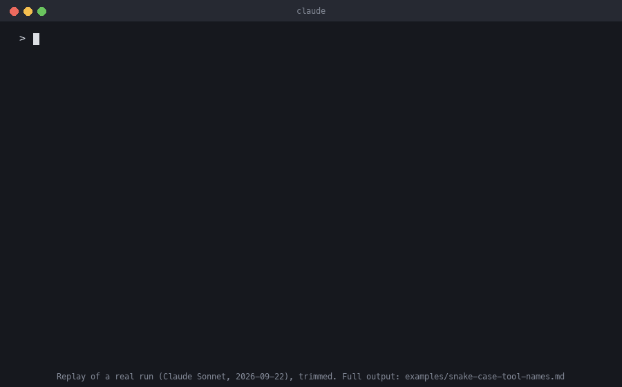

# ai-pm-skills

Claude Code skills for AI product managers, taken from how I actually make product decisions when building AI tools.



<sub>Replay of a real `/build-or-not` run, trimmed. Full output: [examples/snake-case-tool-names.md](examples/snake-case-tool-names.md). Regenerate with `python3 docs/make_demo_gif.py`.</sub>

| Skill | What it does |
|---|---|
| [`/build-or-not`](#build-or-not) | Answers "should we build this?" by checking the idea against 4–8 real examples *before* anyone writes a spec or any code. Ends with a decision record: build, don't build, or narrow and re-check. |
| [`/eval-plan`](#eval-plan) | Turns a PRD into an evaluation plan with pass/fail launch gates set *before* any results exist, built around the one error that actually hurts users. |
| [`/agent-trust-review`](#agent-trust-review) | Sorts every way an AI agent could fail into covered (with evidence), declined on purpose (with a reason), and genuinely missing, and gives two honest coverage numbers. |

## Install

In Claude Code:

```
/plugin marketplace add vishalhabib99/ai-pm-skills
/plugin install ai-pm-skills@ai-pm-skills
```

Or from a terminal:

```bash
claude plugin marketplace add vishalhabib99/ai-pm-skills
claude plugin install ai-pm-skills@ai-pm-skills
```

Then run:

```
/ai-pm-skills:build-or-not <the feature someone just proposed>
/ai-pm-skills:eval-plan <path to a PRD, or a description of the AI feature>
/ai-pm-skills:agent-trust-review <agent description, PRD, or repo path>
```

## `/build-or-not`

Most bad builds aren't badly executed. They're features for a problem that turns out to be rare, out of reach, or already solved, and you can usually find that out in an hour by looking at a handful of real cases.

The skill walks through six steps:

1. **Turn the idea into a claim you could be wrong about.** Broad categories ("governance", "better onboarding") get narrowed to one pattern you can observe.
2. **Choose the sample before looking at it.** Pick 4–8 real, in-the-wild examples using a stated rule, so the sample isn't just the cases that confirm the idea.
3. **Set the bar in advance.** Define what counts as a hit and how many hits justify building, before checking anything.
4. **Check each example and record evidence** a reader can verify: a file and line, a link, a quote. Hits your feature couldn't actually reach are listed but don't count toward the bar.
5. **Decide:** build, don't build, or narrow and re-check (at most twice).
6. **Write the decision record,** short enough to paste into a PRD or a ticket.

A "don't build" backed by evidence is a result, not a failure. It goes on a "declined on purpose" list so the same idea doesn't get argued over from scratch next quarter.

### Example run

Prompt: *"Add a check to [mcp-doctor](https://github.com/vishalhabib99/mcp-doctor) that flags MCP servers whose tool names aren't snake_case."* Run with Claude Sonnet on 2026-09-22 and lightly trimmed. I spot-checked the evidence; the full, untrimmed record is in [`examples/`](examples/snake-case-tool-names.md).

> **Claim checked:** Real, actively used MCP servers define at least one tool name that isn't snake_case.
> **Sample:** 6 real MCP server repos, taken in descending star order from the `mcp` GitHub topic (lists, SDKs and multi-purpose platforms excluded). `googleapis/mcp-toolbox` was scored N/A (its tool names come from user config, not its own code) and replaced.
> **Bar (set before checking):** hit = at least one non-snake_case tool name; build if 3+ of 6.
>
> | # | Example | Result |
> |---|---|---|
> | 1 | DeusData/codebase-memory-mcp | Miss |
> | 2 | microsoft/playwright-mcp | Miss |
> | 3 | github/github-mcp-server | Miss |
> | 4 | idosal/git-mcp | Miss |
> | 5 | GLips/Figma-Context-MCP | Miss |
> | 6 | wonderwhy-er/DesktopCommanderMCP | Miss |
>
> **Decision:** Don't build. 0 of 6 servers (C, TypeScript and Go) had a single non-snake_case tool name, so the check would report "clean" on almost every real server.
> **What would reopen this:** evidence that servers whose tool names come from user config commonly produce non-snake_case names. mcp-toolbox's own README example is `search-hotels-by-name`, so the risk may sit in config files, which this sample didn't test.

That last line is the part I care about most: the skill doesn't only say no, it points to where the real question is.

## `/eval-plan`

An eval only protects you if it can fail. Most AI eval plans can't: the test set only has the easy cases, the bar gets set after the numbers come in, or one accuracy number hides the error that actually hurts users.

The skill:

1. **Names the worst error** and which way the costs lean (a confident wrong answer vs. a missed case), before picking any metric.
2. **Lists what the feature must do and what it must refuse to do.** The second list is where most AI features fail.
3. **Designs the test set up front**, with deliberate negatives (inputs that should match nothing) and known hard cases, not just the happy path.
4. **Sets pass/fail launch gates now**, each tied to the cost of being wrong, plus a guardrail metric that must not get worse.
5. **Runs the cheapest baseline first**, which tests the eval as much as the model.
6. **Decides the post-launch sampling and the rollback trigger** before launch.

### What it's based on

A [practice triage prototype](https://github.com/vishalhabib99/ai-pm-portfolio/tree/main/prototypes/ticket-triage-rag) set its bar in the PRD before any code: ≥95% precision on confident predictions, because a confident wrong reply is the costly error. The test set included two off-topic tickets on purpose. The cheap baseline scored **60% and failed the gate**: both off-topic tickets were confidently matched to `billing`. The first three sample tickets had all looked fine by eye. Only the deliberate negatives caught it.

### Example run

Run against a harder input, the PRD for a tool that [scores whether an AI agent can be trusted](https://github.com/vishalhabib99/ai-pm-portfolio/blob/main/prds/2026-09-agent-outcome-trust-score.md), so the thing being evaluated is itself an evaluator. The skill noticed that and split the test set in two: tasks for the agent, and human-labeled transcripts to check the scorer against. With only one person labeling, it proposed a blind re-label later instead of claiming a two-labeler agreement rate. Its main gate: **≥95% precision on "success" verdicts**, because a scorer that approves a failed run is the exact problem the tool exists to fix. Full plan in [`examples/`](examples/eval-plan-agent-outcome-trust-score.md).

## `/agent-trust-review`

Most agent risk reviews list what the team did, which makes coverage look complete. This one sorts all 17 risk areas (tools, model behavior, operations, people) into three lists:

- **Covered:** only with evidence someone can check: a test, an eval result, a config line. "We log everything" with nothing to point at is *claimed, not verified*, and counts as missing.
- **Declined on purpose:** only with a reason and a reopen trigger. "We skipped it" is not a decline.
- **Genuinely missing:** ranked by how bad it would be, with the smallest next step for the top three.

It ends with two coverage numbers, against what the team chose to own and against the full map, because one number alone misleads. It's based on the [review of my own MCP tools](https://github.com/vishalhabib99/mcp-doctor): 12 areas covered, 9 declined on purpose (each with a reason), 2 genuinely missing, which works out to roughly 80–85% of the chosen niche and 25–30% of AI agent testing overall.

## Tested, including a failure

All three skills have an [eval suite](evals/) with launch gates committed before the first run, and each is run with and without the plugin to show what it adds. The first run **failed**: with no evidence available, `/build-or-not` still gave a firm verdict from recalled market knowledge. The skill was fixed to make "can't decide yet" its own outcome, and the second run passed every gate.

| | With the skills | Plain Claude |
|---|---|---|
| States the bar before deciding | 3 of 3 runs | 0 of 3 |
| Refuses a verdict when there's no evidence | 3 of 3 | 0 of 3 |
| Plans a rollback trigger for launch | 3 of 3 | 1 of 3 |

| Separates a reasoned decline from an unexplained gap | 3 of 3 | 2 of 3 |
| Gives two coverage numbers (owned areas vs. full map) | 3 of 3 | 0 of 3 |

`/agent-trust-review` needed four runs to measure cleanly, and every fix was to my test cases, not the skill. On several other cases plain Claude already did as well. The [results](evals/README.md#results) cover all of it.

## Where `/build-or-not` comes from

I built [mcp-doctor](https://github.com/vishalhabib99/mcp-doctor), [mcp-fuzz](https://github.com/vishalhabib99/mcp-fuzz) and [mcp-reality-check](https://github.com/vishalhabib99/mcp-reality-check), open-source trust and quality tools for MCP servers. Several of their biggest product decisions were made this way, and `/build-or-not` includes them as worked examples:

- **Declined:** an audit of MCP resources and prompts. Only 1 of 8 real servers used them.
- **Narrowed, then declined:** a governance/compliance check. Narrowed to "financial or personal identifiers logged unredacted", it found 1 real hit in 4 servers, but in a sync script no agent tool call could reach.
- **Built:** remote (HTTP) support for the runtime testers, after a real server turned out to be unreachable without it. The first HTTP run exposed a crash-handling bug that stdio had hidden.

## Roadmap

Planned next, each based on something I've already done by hand:

- `/honest-launch`: a launch post that only claims what's been verified.

## License

MIT
